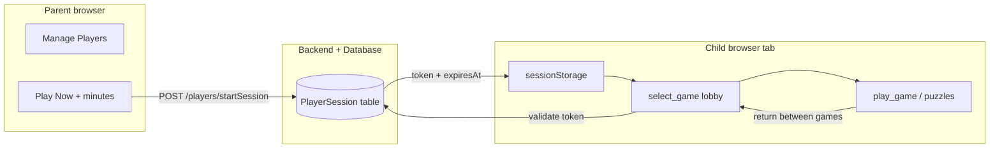
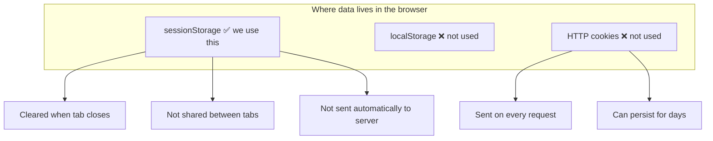
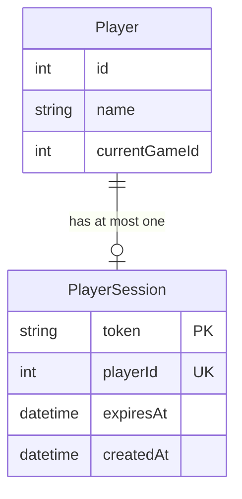
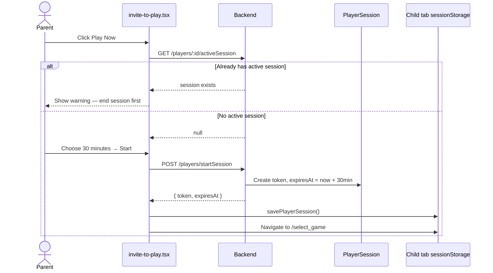
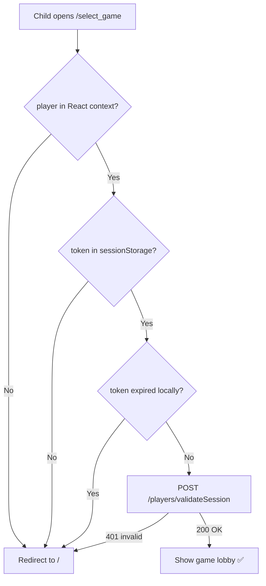
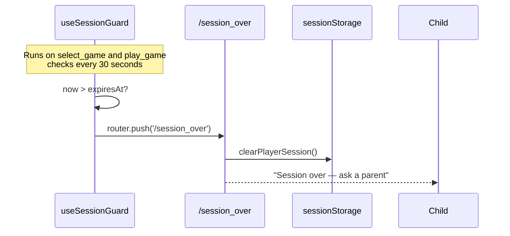
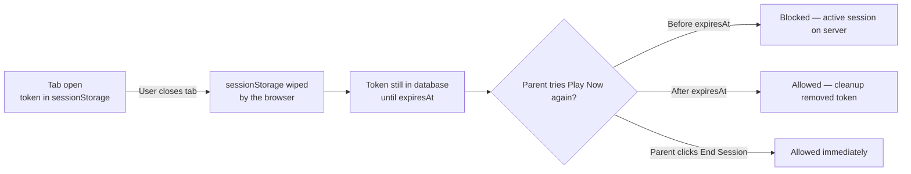
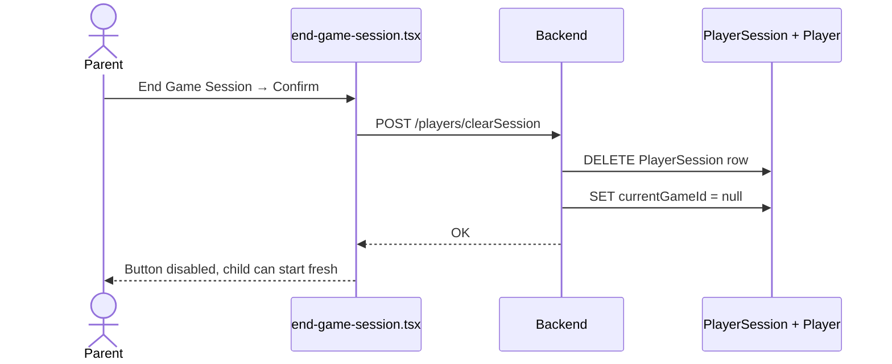
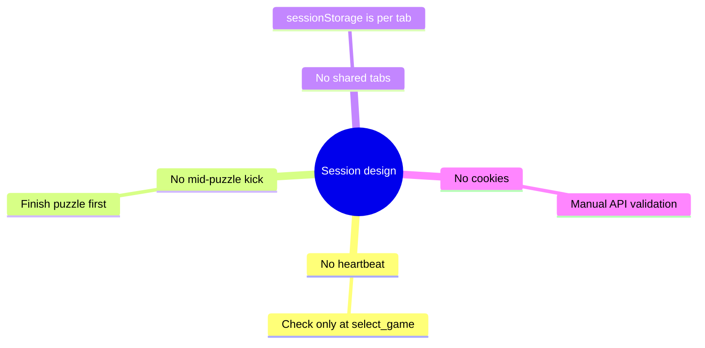

# Player Session Tokens — Plain English Guide

This document explains how **child play sessions** work in Dicteé.

> **Important:** These are **session tokens**, not cookies.  
> The browser stores them in **`sessionStorage`** (one tab only). We do **not** use HTTP cookies for player sessions.

---

## Why does this exist?

A **parent** logs in and starts a play session for a **child (player)**.

We need to answer three simple questions:

| Question | How we answer it |
|----------|------------------|
| Is this child allowed to play right now? | Check the session token |
| How long can they play? | Parent sets minutes → `expiresAt` |
| Can two browsers play as the same child at once? | **No** — only one active token per player |

Before session tokens, we only tracked `currentGameId` (is the child inside a game?). That was not enough — a parent could accidentally start two sessions in different tabs.

---

## The big picture

Think of it as a **temporary wristband** at a theme park:

- The **backend** prints the wristband (token + expiry time).
- The **browser tab** holds the wristband (`sessionStorage`).
- The **bouncer** (`select_game` page) checks the wristband before letting the child in again.
- When time is up, or the parent says “stop”, the wristband is removed.

---

## Session tokens vs cookies vs localStorage

| Storage | Used? | Why / why not |
|---------|-------|----------------|
| **`sessionStorage`** | ✅ Yes | One tab = one session. Closing the tab clears it automatically. |
| **`localStorage`** | ❌ No | Would survive tab close and confuse session logic. |
| **Cookies** | ❌ No | Not needed. We send the token manually in API calls when validating. |

### What is stored in `sessionStorage`?

Three keys in `apps/frontend/lib/player-session.ts`:

| Key | Example | Meaning |
|-----|---------|---------|
| `playerSessionPlayerId` | `42` | Which child is playing |
| `playerSessionToken` | `a1b2c3d4-...` | Secret session ID (UUID) |
| `playerSessionExpiresAt` | `2026-06-09T15:30:00.000Z` | When play time ends |

---

## Database: `PlayerSession` table

One row = one active session for one player.

| Column | Purpose |
|--------|---------|
| `token` | Unique session ID (primary key) |
| `playerId` | Which child — **unique**, so max 1 session per player |
| `expiresAt` | Hard deadline set by parent (now + N minutes) |
| `createdAt` | When the session was started |

**Separate from game state:** `Player.currentGameId` still tracks “is this child inside a running game?”. Session token tracks “is this child allowed to use the app at all?”.

---

## API endpoints

| Method | Path | Who calls it | What it does |
|--------|------|--------------|--------------|
| `POST` | `/players/startSession` | Parent (Play Now) | Creates token if none active → else **409 Conflict** |
| `POST` | `/players/validateSession` | Child tab (`select_game`) | Checks token is real and not expired |
| `GET` | `/players/:id/activeSession` | Parent UI | Returns active session or `null` |
| `POST` | `/players/clearSession` | Parent (End Game Session) | Deletes token **and** clears `currentGameId` |

---

## Flow 1 — Parent starts “Play Now”

**Step by step:**

1. Parent picks a child and clicks **Play Now**.
2. Frontend asks: “Does this child already have an active session?”
3. If **yes** → show error. Parent must click **End Game Session** first.
4. If **no** → parent enters minutes (e.g. 30).
5. Backend creates a `PlayerSession` row.
6. Frontend saves token into **`sessionStorage`** (not a cookie).
7. Child browser opens `/select_game`.

---

## Flow 2 — Child enters the game lobby (`select_game`)

This is the **checkpoint**. Every time the child lands here (after puzzles, leaving a game, etc.), we verify the session.

**We do not interrupt mid-game.** Expiry is checked when entering `select_game`, not during an active puzzle or `play_game`.

---

## Flow 3 — Time runs out

| Event | What happens |
|-------|----------------|
| Timer expires while on `select_game` or `play_game` | Redirect to `/session_over` |
| Child clicks OK | Goes to landing page |
| Backend token | Still exists until `expiresAt` or cleanup job — but child tab has no valid local token |

---

## Flow 4 — Child closes the browser tab

**This is intentional and safe:**

- Closing the tab does **not** call the server.
- The server token may linger until `expiresAt`.
- Parent can always force-stop via **End Game Session**.
- A background job deletes expired tokens every **5 minutes**.

So: tab close, crash, or lost Wi‑Fi **never permanently locks** a child out — time or parent action fixes it.

---

## Flow 5 — Parent ends session early

The child’s tab may still show UI until they navigate — but the next visit to `select_game` will fail validation and redirect home.

---

## What we deliberately do **not** do

| Not implemented | Reason |
|-----------------|--------|
| Heartbeat / ping every N seconds | `select_game` mount is enough |
| Kick child during active puzzle | Bad UX; check between games |
| Same session in two tabs | `sessionStorage` is per-tab by design |
| Cookie-based auth | Tokens sent only when we validate |

---

## File map (where to look in code)

| Layer | File | Role |
|-------|------|------|
| Frontend storage | `apps/frontend/lib/player-session.ts` | Read/write `sessionStorage` |
| Parent starts session | `apps/frontend/app/manage_players/_components/invite-to-play.tsx` | Play Now UI |
| Checkpoint | `apps/frontend/app/select_game/page.tsx` | Validate on mount |
| Timer guard | `apps/frontend/app/hooks/use-session-guard.ts` | Redirect when time is up |
| Parent force-stop | `apps/frontend/app/manage_players/_components/end-game-session.tsx` | Clear session |
| Backend logic | `apps/backend/src/players/players.service.ts` | Create / validate / delete |
| Backend routes | `apps/backend/src/players/players.controller.ts` | HTTP endpoints |
| Database | `packages/database/prisma/schema.prisma` | `PlayerSession` model |

---

## Quick troubleshooting

| Symptom | Likely cause | Fix |
|---------|--------------|-----|
| “Already has active session” right after tab close | Server token not expired yet | Wait, or parent clicks **End Game Session** |
| Child sent to `/` on `select_game` | No token in `sessionStorage` (wrong tab, refresh issue) | Parent starts **Play Now** again |
| Child sent to `/session_over` | Play time finished | Parent starts a new session |
| Two tabs, same child | Only the tab that received Play Now has the token | Expected behaviour |

---

## Summary in one sentence

> A parent starts a timed session → the backend issues one token per child → the child’s tab keeps it in **sessionStorage** → **`select_game` checks it** before play continues → the parent or the clock ends it.
