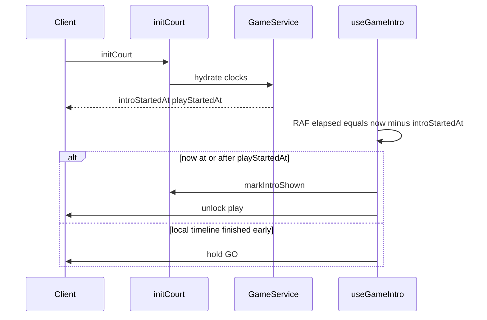

# Code review: PR #286 — Refactor/game shared elements

**PR:** [phteeven1/ft_transcendence#286](https://github.com/phteeven1/ft_transcendence/pull/286)
**Author:** Callcold1 · **Base:** `development` · **+2754 / −1897** across ~84 files
**CI:** Backend and Frontend both passing
**Bugbot:** 1 finding ([review](e25cc9d5-b596-4aa4-b26a-86c2f80ea74c))

This is a review, not an implementation plan. Suggested fixes are listed at the end if you want them applied next.

---

## Verdict

**Approve with one required fix.** The shared overlay/hook extraction is the right direction and the progression/`leftEarly` work is consistent. Do not merge until Word Building’s post-refresh multiplayer detection is fixed — that is a real gameplay regression, not a style nit.

The refactor goal (dedupe intro/outro/leave) is largely met. Word Building still carries more orchestration in [`word-building-game.tsx`](apps/frontend/app/word_building/_components/word-building-game.tsx) than Word Soup does in hooks; that is leftover, not a blocker.

---

## What the PR does well

- Shared outro UI in [`apps/frontend/app/components/game/overlay/`](apps/frontend/app/components/game/overlay/) replaces two ~300-line per-game overlays.
- Server-authoritative intro clock via [`intro-sync.ts`](apps/backend/src/games/intro-sync.ts) + [`use-game-intro.ts`](apps/frontend/app/hooks/game/use-game-intro.ts): clients unlock at `playStartedAt`, shorter locales hold on GO. That is the correct multiplayer model.
- Unified `POST /games/:gameId/markIntroShown` on [`games.controller.ts`](apps/backend/src/games/games.controller.ts) (player from session, not body). Old Word Soup-only route is gone.
- Leave keeps `GamePlayer` rows (`leftAt`) so scores/progression survive; [`progression-outcome.service.ts`](apps/backend/src/progression/progression-outcome.service.ts) and [`progression-history.ts`](apps/backend/src/progression/progression-history.ts) skip leavers for XP/wins.
- Backend tests expanded (`games-leave-finish`, soup persist, progression). Good.
- Auth model unchanged (`PlayerSession` / `PlayerSessionGuard`).



---

## Must-fix before merge

### Word Building treated as solo after opponent leaves + refresh

[`toApiGame`](apps/backend/src/common/mappers.ts) now returns **active** players only:

```89:93:apps/backend/src/common/mappers.ts
    players: game.gamePlayers
      .filter((gp) => gp.leftAt == null)
      .map((gp) => gp.playerId),
```

Word Building seeds `rosterPlayerIds` from `GET /games/:id` and uses that for multiplayer:

```278:278:apps/frontend/app/word_building/_components/word-building-game.tsx
      setRosterPlayerIds(loadedGame.players);
```

```189:191:apps/frontend/app/word_building/_components/word-building-game.tsx
  const isMultiplayer = (rosterPlayerIds?.length ?? playerNames.size) > 1;
  const isCelebratingFinalLetter =
    isMultiplayer && finalLetterPlacedSeq > 0 && finalLetterPlacedSeq > dismissedCelebrationSeq;
```

The comment above this code says `rosterPlayerIds` is the authoritative original roster so a late `playerNames` fetch cannot under-count. After this mapper change that is no longer true.

**Repro:** 2-player Word Building → opponent leaves → remaining player refreshes → `rosterPlayerIds.length === 1` → final-letter celebration and multiplayer outro hold are skipped.

**Fix:** Derive original roster from `getPlayersForGame` / `initCourt.leftPlayers` (full historical set), not from `Game.players`. `playerNames` already comes from `getPlayersForGame`, which still returns leavers ([`findPlayersForGame`](apps/backend/src/games/games.service.ts) does not filter `leftAt`).

Word Soup is safe here: it uses `getPlayersForGame` for the roster and `leftPlayers` for abandon copy.

---

## Should-fix

### Abandon modal can show the wrong copy until names load

```565:572:apps/frontend/app/word_building/_components/word-building-game.tsx
  const isLastRemaining = useMemo(
    () =>
      computeIsLastRemaining(
        [...playerNames.keys()],
        playerId,
        leftPlayers,
      ),
    [leftPlayers, playerId, playerNames],
  );
```

[`computeIsLastRemaining`](apps/frontend/app/hooks/game/game-leave.helpers.ts) returns `false` when `participantIds` is empty. `playerNames` is filled by a separate async fetch, so the first paint can show “others keep playing” / the leave-XP warning for a solo or last-player match.

Soup already uses the loaded roster (`players.map((entry) => entry.id)`). WB should use `rosterPlayerIds` **plus leavers**, or `playerNames` once it is ready, not an empty map.

### Welcome bubble can jump mid-intro

`introTexts.welcome` depends on `playerNames.get(playerId)` ([`word-building-game.tsx`](apps/frontend/app/word_building/_components/word-building-game.tsx) ~130–138). Names arrive after `initCourt`. [`use-game-intro.ts`](apps/frontend/app/hooks/game/use-game-intro.ts) updates `introTextsRef` without resetting elapsed time, so the welcome line can change partway through typing.

Use a stable placeholder until the name is known, or delay starting the intro RAF until names exist (server estimate already pads with `'XXXXXXXXXXXXXXXX'`).

---

## Intentional behavior changes (confirm, do not silently ship)

- **Word Building abandon no longer shows a score screen.** Leave now goes through [`useGameLeave.leaveToLobby`](apps/frontend/app/hooks/game/use-game-leave.ts) (REST leave + navigate), matching Soup. The old WB-only “fetch finish outcome and overlay” path is gone. Aligning the two games is reasonable; it is still a user-visible regression for WB.
- **`Game.players` is now “still in the match,” not “ever joined.”** Lobby and leave/finish clearing of `currentGameId` look updated. Any other consumer of `GameDto.players` as a historical roster will be wrong. Worth a one-line note in the PR description.
- **Everyone-abandons skips outro** via [`useAbandonFinishRedirect`](apps/frontend/app/hooks/game/use-game-leave.ts). Intentional; remaining player never sees scores.

---

## Lower priority / nits

- **Layering:** [`restore-player-session.ts`](apps/frontend/lib/restore-player-session.ts) imports `SESSION_RESTORE_TIMEOUT_MS` from `@/app/hooks/game/game-leave.helpers`. `lib/` should not depend on `app/hooks`. Move the constant into `lib/`.
- **Timing constants triplicated** in `intro-sync.ts`, `use-game-intro.ts`, `use-game-over.ts`. Documented for intro; outro is not. Drift will desync silently. A shared constants module (or a test that asserts they match) would lock this.
- **`buildFallbackFinishOutcome`** ([`game-over.helpers.ts`](apps/frontend/app/hooks/game/game-over.helpers.ts) ~109–131) hard-codes `leftEarly: false`. Soup uses this when the socket/API outcome is missing (`use-word-soup-game.ts` ~366). Leavers can appear in outro rankings.
- **Word Soup still has no `currentGameId` stale-tab guard.** WB blocks re-entry after leave ([`word-building-game.tsx`](apps/frontend/app/word_building/_components/word-building-game.tsx) ~271–273). Soup only checks `isFinished`. Pre-existing, still inconsistent after a “shared leave” refactor.
- **WB overlay wrapper uses inline `style={{ maxWidth: '...' }}`** ([`word-building-game.tsx`](apps/frontend/app/word_building/_components/word-building-game.tsx) ~815). Repo rule is Tailwind only.
- **In-memory `markIntroShown`:** hydrate reconstructs from wall clock (`introWindowOver`), which is actually the right model for a shared timeline. Not a bug. Silent `.catch()` on the client is fine given that.

---

## Tests

Covered: leave/finish, soup `playStartedAt` persist, WB player-left/final-letter, progression leavers.

Missing: `toApiGame` active-roster filter vs WB `isMultiplayer`; `intro-sync` vs frontend constants; `markIntroShown` dispatch; no frontend tests for the new hooks.

---

## Suggested PR description addendum

Call out: (1) `Game.players` is active-only; (2) WB abandon no longer shows scores; (3) both games share one intro clock and one outro overlay.
